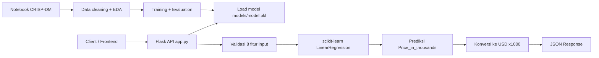

# Prediction Price Car System


> Sistem prediksi harga mobil dengan algoritma Linear Regression yang disajikan melalui REST API Flask.

Project ini dibuat untuk tugas akhir mata kuliah Data Science semester 6, dengan fokus implementasi end-to-end dari proses analisis data, training model, hingga serving model melalui API.

Model dilatih menggunakan dataset penjualan mobil (`Car_sales.xls`) dan memprediksi `Price_in_thousands` berdasarkan 8 fitur teknis kendaraan. Hasil prediksi dari model (dalam ribuan USD) dikonversi menjadi nilai USD pada endpoint API.

## ✨ Fitur Utama

- Prediksi harga mobil via endpoint `POST /predict`.
- Endpoint monitoring sederhana: `GET /` dan `GET /health`.
- Validasi input JSON dan pengecekan fitur wajib.
- Model tersimpan sebagai artifact `models/model.pkl` dan dimuat saat startup.
- Notebook analisis dan training berbasis CRISP-DM di `models/notebook/main.ipynb`.
- Konfigurasi deployment ke Vercel (`vercel.json`).

## 🏗️ Arsitektur & Tech Stack



### Tech Stack

| Kategori | Teknologi |
|---|---|
| Bahasa | Python |
| API Framework | Flask 3.1.3 |
| CORS | flask-cors 5.0.0 |
| Machine Learning | scikit-learn 1.8.0 (Linear Regression) |
| Data Processing | pandas 3.0.2, numpy 2.4.4 |
| Model Serialization | joblib, pickle |
| Deployment | Vercel (`@vercel/python`) |
| Eksplorasi Data | Jupyter Notebook (`models/notebook/main.ipynb`) |

Arsitektur project bersifat sederhana (single-service): satu Flask app untuk inference dan satu notebook untuk pipeline analitik/training.

## 🔄 Pipeline (CRISP-DM)

Implementasi di `models/notebook/main.ipynb` mengikuti alur CRISP-DM:

1. **Business Understanding**
   - Tujuan: memprediksi harga mobil untuk membantu estimasi harga berdasarkan spesifikasi teknis.
   - Konteks akademik: final project mata kuliah Data Science semester 6.

2. **Data Understanding**
   - Sumber data: `models/data/raw/Car_sales.xls`.
   - Dataset awal: 157 baris, 16 atribut (sesuai output notebook).
   - Target: `Price_in_thousands`.

3. **Data Preparation**
   - Drop baris yang tidak memiliki target (`Price_in_thousands`).
   - Imputasi missing value:
     - Kolom numerik: median.
     - Kolom kategorikal: modus.
   - Simpan hasil preprocessing ke `models/data/processed/Car_sales_cleaned.csv`.
   - Jumlah data hasil cleaning: 155 baris.
   - Bentuk dataset fitur/target ke `models/data/processed/X.csv` dan `models/data/processed/y.csv`.

4. **Modeling**
   - Algoritma: `LinearRegression` dari scikit-learn.
   - Fitur model (8):
     - `Engine_size`
     - `Horsepower`
     - `Wheelbase`
     - `Width`
     - `Length`
     - `Curb_weight`
     - `Fuel_capacity`
     - `Fuel_efficiency`
   - Split data: train 80% / test 20% (`random_state=42`).

5. **Evaluation**
   - Metrik evaluasi di notebook:
     - RMSE: `7.3908`
     - R2 Score: `0.7459`
   - Visualisasi evaluasi: scatter plot actual vs predicted.

6. **Deployment**
   - Model diekspor ke `models/model.pkl`.
   - API Flask memuat model saat startup dan melayani prediksi melalui endpoint `/predict`.

## 📋 Prerequisites

- Python 3.10+ (disarankan)
- `pip`
- (Opsional) Jupyter Notebook untuk menjalankan notebook training
- (Opsional, deployment) Vercel CLI

## 🚀 Instalasi & Setup

### 1. Clone Repository

```bash
git clone <url-repository>
cd prediction-price-car-system
```

### 2. Install Dependencies

```bash
pip install -r requirements.txt
```

Catatan: notebook mengimpor `matplotlib` dan `seaborn`, tetapi keduanya belum tercantum di `requirements.txt`. Jika ingin menjalankan notebook:

```bash
pip install matplotlib seaborn jupyter
```

### 3. Konfigurasi Environment

Project ini tidak menyediakan `.env.example` dan tidak membutuhkan environment variable wajib untuk menjalankan API lokal.

### 4. Pastikan Artifact Model Tersedia

Pastikan file model ada di:

```text
models/model.pkl
```

Jika file model belum ada, jalankan ulang pipeline training dari notebook `models/notebook/main.ipynb` sampai tahap export model.

## 💻 Menjalankan Project

### Development

```bash
python app.py
```

Server berjalan di:

```text
http://localhost:8080
```

### Production

Konfigurasi production saat ini menggunakan Vercel (`vercel.json`):

```bash
vercel --prod
```

### Testing

Belum tersedia automated test suite pada repository ini. Verifikasi fungsi API dilakukan melalui endpoint check/manual test.

Contoh health check:

```bash
curl http://localhost:8080/health
```

Contoh prediksi:

```bash
curl -X POST "http://localhost:8080/predict" -H "Content-Type: application/json" -d '{"Engine_size":2.5,"Horsepower":170,"Wheelbase":107.0,"Width":70.5,"Length":187.8,"Curb_weight":3.2,"Fuel_capacity":17.2,"Fuel_efficiency":26}'
```

## 📡 API Reference

### Base URL

`http://localhost:8080`

### Endpoints Overview

| Method | Endpoint | Deskripsi | Auth |
|---|---|---|---|
| GET | `/` | Info API + daftar endpoint + fitur model | No |
| GET | `/health` | Status health service dan status model | No |
| POST | `/predict` | Prediksi harga mobil dari 8 fitur | No |

### Request Body `POST /predict`

```json
{
  "Engine_size": 2.5,
  "Horsepower": 170,
  "Wheelbase": 107.0,
  "Width": 70.5,
  "Length": 187.8,
  "Curb_weight": 3.2,
  "Fuel_capacity": 17.2,
  "Fuel_efficiency": 26
}
```

### Contoh Response Sukses

```json
{
  "status": "success",
  "predicted_price": 25062.9,
  "currency": "USD",
  "input_features": {
    "Engine_size": 2.5,
    "Horsepower": 170.0,
    "Wheelbase": 107.0,
    "Width": 70.5,
    "Length": 187.8,
    "Curb_weight": 3.2,
    "Fuel_capacity": 17.2,
    "Fuel_efficiency": 26.0
  }
}
```

## 📁 Struktur Project

```text
prediction-price-car-system/
|- app.py
|- requirements.txt
|- vercel.json
|- models/
|  |- model.pkl
|  |- data/
|  |  |- raw/
|  |  |  |- Car_sales.xls
|  |  |- processed/
|  |     |- Car_sales_cleaned.csv
|  |     |- X.csv
|  |     |- y.csv
|  |- notebook/
|     |- main.ipynb
|- .vercel/
|  |- project.json
|  |- README.txt
|- .gitignore
```

## 🔧 Konfigurasi

- `MODEL_PATH` di `app.py` menunjuk ke `models/model.pkl`.
- Daftar fitur wajib prediksi ditetapkan pada konstanta `FEATURES` di `app.py`.
- CORS pada Flask diizinkan untuk:
  - [data-science-prediction-price-car-w.vercel.app](https://data-science-prediction-price-car-w.vercel.app/)
  - `http://localhost:3000`
